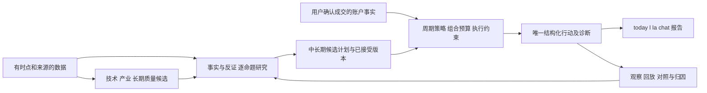

# 暮云长期路线与持续里程碑

**唯一长期路线入口｜更新：2026-10-02｜目标基线：V1｜整体：未完成。**

本文件回答“最终做成什么、现在在哪、还差什么、什么时候算完成”。每批实现与审批状态见 [STATUS](plan/fusion/STATUS.md)，当前审批见 [R15](plan/fusion/iteration9/R15_ACCEPTANCE.md)，下一执行窗口见 [第九轮](plan/fusion/iteration9/DELIVERY_PLAN.md)。F/R/J/K/L/M/N/O/P 是实施批次，下面 G0–G8 是稳定的产品里程碑，两者不可混用。

## 一、长期期望与范围基线

沿用用户已确定的目标，来源为 [融合愿景](plan/fusion/README.md)、[融合设计](plan/fusion/DESIGN.md)、[总体工程架构](plan/ARCHITECTURE.md)及2026-10-01本会话要求。下表是既定目标的归纳；具体阈值尚待验证的部分不伪称用户已拍板。

| 需求 | 理想能力 | 最终能观察到的行为 | 承接 |
|---|---|---|---|
| R01 中长期并存 | 中期研究催化剂与盈利兑现；长期研究企业质量、现金创造、估值与失效条件 | 两种周期各有合法正例与反例；亏损中期不会自动变长期；一个实际持仓主意图 | G3/G4 |
| R02 三方融合 | 笨韭提出产业/企业假设，技术与技能引擎负责广泛筛选、择时和纪律，AI提取事实、反证与解释 | 一个带条件的终态结论，能追到证据；不把三份意见重复计票 | G2/G3/G5 |
| R03 清楚的日常体验 | today先处理持仓和重大风险，l统一单股，la/批量接续，bz/scan保留专家入口 | 能回答做什么、为什么、什么条件改变；细节可展开，重大风险不被简洁界面隐藏 | G2 |
| R04 研究持续演进 | 候选→原文→核验→命题→计划→接受→复核→归因 | 新材料形成候选、旧接受态不被覆盖；检查点有证据及用户风险确认；重启可找回 | G1/G3/G4 |
| R05 账户与组合约束 | 建议和真实成交分开；数量、现金、成本、可卖份额与组合预算一致 | 部分成交、异常恢复、资金不足、停牌等情境下事实不丢、不重复、不假精确 | G1/G5 |
| R06 有价值的机会发现 | 技术/产业/长期质量召回，去重后在有限研究预算内排序 | 来源、漏选/误选、增量覆盖与费用可比较；不是仅增加扫描数量 | G5/G6 |
| R07 有依据的AI和知识检索 | 公司事实与方法知识分开；来源、时点、反证可审计；缓存避免重复付费 | 检索质量/提取准确性用独立集验证，缺数据如实说；解释不能改写底层动作 | G3/G4/G7 |
| R08 效果可验证 | 正确性、可用性、投资效果分别验证，支持历史回放与前瞻观察 | 可复现实验与失败记录；只有相应周期的证据过门才晋级 | G6 |
| R09 工程更可靠精简 | 模块化单体、共享业务入口、清晰依赖、可恢复存储、可诊断外源 | 新功能改动面缩小；跨端语义一致；卡死、内存、耗时和请求量有基线及改善证据 | G7 |

范围边界：A股研究与决策辅助；不接自动实盘下单。REPL是首要验收入口；已有chat/Web/TUI须保持兼容并逐步共用语义，不在本基线主动重做视觉界面。同股多意图分仓、微服务、多Agent产品平台均未纳入V1；新增需求需明确影响和取舍。Codex额度守护是独立开发工具方案，用户尚未要求部署，不算投资产品交付。

## 二、基本架构：贯穿每轮的固定框架

保持现有Python单体；复用现有服务并明确数据所有权：账户事件拥有成交事实，原文/快照拥有证据，AssessmentStore拥有评估，计划库拥有精确接受版本，展示只投影终态。可用性、计算成功、事实核实、命题成立、用户接受、可执行、实验有效分别判定，不相互替代。

工程重构围绕这些边界推进：先验证语义，再收拢重复入口，最后删兼容壳。不能以移动文件或减少行数代替收益证明。

## 三、持续里程碑总表

状态：`已验收`必须有指定范围的独立证据；`部分完成`含已实现和未达门槛项；`待实施`没有实现；`证据受阻`不能算完成。当前没有整体完成的产品里程碑，不以批次测试数量计算百分比。

| ID | 能力里程碑 | 当前状态（2026-10-02） | 已有基础 | 达成标准与关键剩余 |
|---|---|---|---|---|
| G0 | 目标、基线和长期路线可持续恢复 | 框架已建立；随批维护 | 早期ADR、验证规范、本文件、R15 | 需求都有里程碑和验证；每次审批同步状态、证据和下阶段；读入口无冲突 |
| G1 | 事实与账户可信 | 部分完成 | O批独立33文件462绿；R14六检查全绿；O1/O2验收 | O0异常交叉和返回完整性仍有Z1/Z2→P0；不是所有异常均已闭合。数量/现金/成本在所有消费者一致仍待全链完成 |
| G2 | 统一的日常工作流 | 部分完成 | today/diff/tasks、L2公开引用、O0批量账本清单 | Z3聊天混合清单/启动提示→P1；M2只读接口设计已细化，P0/P1过门+合同冻结才接生产；today持仓卡并集未做 |
| G3 | 中期证据研究与复核闭环 | 部分完成 | typed核验、评估、双槽计划、公开checkpoint TRUE正例 | 完整MID VALID证据包经REPL达成仍待做（L2正例完整评估仍UNESTABLISHED）；原文/反证/业务受益/兑现窗口可追溯，风险确认可恢复；验证AI增量 |
| G4 | 长期企业研究与估值能力 | 部分完成；数据/规则受限 | 独立LONG模板；L3可跟踪清单与6/6负债率原件离线复算通过 | 可比多期财务、现金质量、资本约束、经营优势、估值情景及长期失效规则；先明确行业消费者再核定波次B。更正/PIT/缺URL尚未齐，不能以MID替代 |
| G5 | 候选召回、组合分配与成交约束 | 部分完成 | 三路候选/因子登记、预算求解、事件账本 | 固定预算下召回增益；同组合快照分配；净现金/NAV/价格时点/日期化交易规则齐，未知则条件化；逐股数量与组合上限一致 |
| G6 | 可比较的观察与效果晋级 | 证据受阻 | R15接收O1时间资格和O2 LONG边界，捕获/落盘/分母正反例通过 | shadow_v10未冻结，账户残余须先补齐；候选修正后旧协议不追认。真实观察、分周期独立留出实验和付费/数据前置仍未齐 |
| G7 | 必要重构、性能、诊断与多入口一致 | 部分完成 | 请求级快照、B1/B2基线、O批批量入口修复 | P1展示一致；today/analyze_industry/TUI/Web清单剩余未整体关闭；M2只读研究待接线。性能仍先测量，不把B2微型样本说成瓶颈 |
| G8 | V1整体结项与维护移交 | 待实施 | 历史知识资产与回滚机制 | G0–G7按范围过门；必要缺陷/优化/重构清零，用户场景与运维演练通过，文档/依赖/迁移可复现；保留维护流程，不再无目标增加迭代 |

## 四、推进路线与依赖

1. **当前窗口：可信事实贯穿最终输出（G1/G2/G6）**。R15接收O1/O2，O0部分接收；P0补异常交叉/清单完整性，P1补聊天混合清单/同屏提示。固定矩阵和公开入口同次回执过门再裁定K1冻结，不重做已通过时间/LONG设计。
2. **下一窗口：日常统一与首个完整中期样板（G2/G3/G5）**。M2原型25断言已由R14接收，第九轮已细化只读查询接口/共享渲染/八类验收；P0/P1独立过门且合同冻结后才接生产。正常RATIO_ONLY也可查看研究，不要求先建数量账本；完整MID VALID样板随后验证。
3. **能力窗口：长期研究、候选与组合（G4/G5）**。先核定字段/期间/行业适用性，再设计命题和估值情景；波次B只做有消费方的字段。先验证一类非金融企业，后按数据质量扩展。此处是方向，详细任务尚未验证、不得直接照标题实施。
4. **贯穿窗口：工程收敛与成本（G7）**。跟随已进入的业务边界逐条归并。先量基线，确认收益再优化；不一次重写main或所有持久化模块。关键正确性问题即时修，独立性能优化按测量收益排序。
5. **效果窗口：前瞻观察和分周期晋级（G6）**。工程完成后才能累计可比较样本；真实时间可与工程后续工作并行，不能用模拟填满。数据或付费受阻时做非依赖任务，保留未完成状态。
6. **结项窗口（G8）**。复验全部需求映射与必要债务清单；确认未来新增方向另起基线，不无限延长V1。

## 五、必要优化/重构台账（不会丢在某轮附录里）

| 固定项 | 依据 | 归属与启动条件 | 关闭证据 |
|---|---|---|---|
| T01 账户事实统一读出口 | O0批量数量清单通过，Z1/Z2异常及Z3展示残余 | G1/G2/G7，P0/P1收口；today卡/analyze_industry/TUI/Web剩余持久登记 | 同版本账户→所有消费者一致，未知不吞退出、不漏清单；当前未整体关闭 |
| T02 研究与计划命令归并 | B1问题明确，M2原型已接收 | G2/G3，R15方案DESIGN_READY；P0/P1过门且合同冻结后生产接线 | 查询不写研究；候选不替换接受态；跨入口同回执；不把run(capture=False)当只读 |
| T03 终态/观察共用字段语义 | 两臂规范包/版本门、O1时点与O2 LONG通过 | G6，账户残余阻断K1冻结；表v4保持，修正观察候选按语义登记 | 捕获/存储/分母一致已验；所有输入资格和主流程输出收口才整体关闭 |
| T04 UI反向依赖与大函数拆分 | 静态盘点src127文件/49475行，main5558行；12个非CLI导入main的语句，详见盘点 | G7；先区分命令桥允许依赖与业务倒置，不按数量定罪 | 边界清单、调用方迁移、等价回放、改动面减少；统计迁移前后，不预设删行目标 |
| T05 外源超时、缓存、批量与资源成本 | ADR02/04、C2/C3；B2证实30股装配重放30次（一事件仅约15ms） | G7；M0请求快照已引入，O0补持仓集合一致性；性能收益另测，不夸大瓶颈 | 同环境输入前后p50/p95、请求数/峰值内存/线程与失败恢复；无显著收益停止 |
| T06 AI/RAG质量与评分口径 | C4/C6及E5；已有独立工具不等于效果完成 | G3/G4/G7；冻结独立集，付费另授权 | 引用正确性/检索质量/提取准确率及成本对照；不自评自证，不擅改legacy公式 |
| T07 数据证据便携与版本化 | L3脚本/清单已跟踪，raw/mapped已分离，6/6离线复验 | G4/G6部分接收；缺J1 URL、更正/人工/PIT/异机获取与旧登记迁移仍待办 | 原件可获取且可离线重建；修订追加不覆盖，当前不宣称全关闭 |

以上是V1已知必要工作。新发现必须说明影响哪个R/G/T、严重性、证据和优先级；没有用户收益或可验证风险的“顺便优化”不加入必做清单。

## 六、每一轮的设计与验收规则

**事实调查 → 最小反例/基线 → 小范围方案或原型 → 设计验证 → 实施 → 独立复验 → 更新本表。**

- 设计状态单列为“未验证 / 原型验证 / 实现复验 / 真实效果验证”，后一级不能由前一级代替。不能凭一张任务卡宣称设计有效。
- 每张可开工卡必须写：对应R/G/T、消费者路径、用户收益、修改边界、前置、正常/失败/迁移、反例和验收命令、资源上限、停止与回滚条件。
- 一次只深入当前依赖已经满足的少量卡。下一窗口只列待验证问题；不得借额度充裕扩大成没有结束条件的研究。
- 固定合同设计见[第六轮设计验证](plan/fusion/iteration6/DESIGN_VALIDATION.md)：19场景与B1/B2基线；第七轮以[R13的17条产品对照探针](plan/fusion/iteration7/ACCEPTANCE_PROBE_RESULTS.json)定位既有合同接线缺口。原型只证明合同可区分正反例，不代表生产实现或投资效果。
- 用户使用反馈验证“是否能做对下一步”；收益验证遵守[VALIDATION](plan/fusion/VALIDATION.md)，提前冻结指标、数据范围、比较基线和成本。门槛未冻结前不宣布效果成功。

## 七、什么叫“所有该做的都完成”

V1结项必须同时满足：R01–R09都有验收证据；G1–G7达到明示支持范围；没有未处理的阻断缺陷；T01–T07的必要条款关闭；安装/迁移/备份恢复/异常退出/跨入口回归可复现；文档与代码一致；默认策略晋级有对应周期效果证据，或用户明确接受较窄发布范围。

数据不足、未授权实验、等待真实观察均是**未完成**，不得用“延期”自动清零。可选扩展仅经明确范围决策移出V1。工程版本可以先交付，但整体基线保持未完成。达到上述标准后转维护，不为消耗额度制造新任务。

## 八、维护职责与更新记录

用户决定目标与重大范围取舍；当前Codex架构师维护本文件并作验收，实施Agent更新实现账本与证据。共享文档不自动改变阅读者身份。每次交付、审批、发现阻断或范围变化，必须同步：**本表对应G/T → STATUS当前动作 → RESUME恢复指针**。历史报告保留日期，不复制过期结论到当前入口。

本文件在每次实际工作会话持续更新；未配置后台任务，不承诺聊天停止后自动监控实施进度。恢复先读本文件和STATUS，比较HEAD/工作树/指纹，再继续未完成依赖。

| 日期 | 变化 | 证据/决定 |
|---|---|---|
| 2026-10-01 | 从批次清单提升为V1长期需求/能力里程碑；修正STATUS总表与恢复记忆漂移 | 用户本轮要求；R11独立复验；第五轮仅启动已验证边界问题 |
| 2026-10-01 | R12审批L系列：281目标绿、六点原件复验；入口引用等范围接收，W1/W2阻断冻结 | M0/M1启动；M2只读接线设计19场景原型通过、待前置；整体未完成 |
| 2026-10-01 | R13审批M系列：381目标绿、17合同场景15红/2绿；原W1投影存在/W2日期范围通过，X1/X2/X3待补 | N0账户消费/N1规范观察与版本/N2时点；M2仅正常只读原型接收，K1不冻结；整体未完成 |

- 2026-10-02 R14：N批分项接收，423目标绿、17旧反例全绿；5新红断言归为Y1–Y4，M2原型25断言接收。K1未冻结/M2生产未放行；O0–O2承接G1/G2/G4/G6与T01/T03，整体未完成。

- 2026-10-02 R15：O1/O2接收，O0部分接收；33文件462绿，13合同项9绿4红（三组Z1–Z3）。K1未冻结/M2未放行；P0/P1 READY，M2只读接口DESIGN_READY。正常RATIO_ONLY无行为变化可接收；不强制迁移真实账户。
