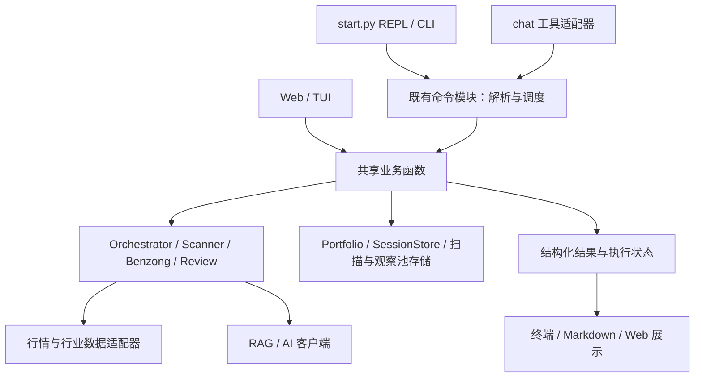

# 总体架构与演进设计

版本：设计稿 1，2026-09-24。负责人：总架构师。本文保留前一轮设计，实施状态以 [README执行记录](README.md) 为准；新一轮中长期能力融合见 [fusion/README.md](fusion/README.md)，不要将历史设计条款全部当作当前待办。

## 一、职责与决策机制

用户确定产品目标与重大取舍；总架构师负责现状调查、架构方案、接口契约、实施分解、验收与迭代排序；执行 Agent 按任务卡实现；审查 Agent 独立核对实现与证据。当前任务只产出和维护设计，不直接修改业务代码或测试。

每批工作闭环：**调查事实 → 定义用户收益 → 明确契约与边界 → 分派实施 → 验收证据 → 更新下一批计划**。执行者发现方案与代码冲突，必须报告事实和候选修订，不自行扩大范围；架构师也必须据证据修改方案。

“允许大改”意味着可以选择必要的结构变更；不以重写规模衡量进展。持续保留能启动、能回退的中间版本。

## 二、四个目标的验收口径

| 目标 | 具体含义 | 证据 |
|---|---|---|
| 更优雅 | 相同业务只有一个实现入口；依赖方向明确；核心计算不依赖终端展示 | 调用图、循环依赖检查、同输入跨入口契约测试 |
| 更可靠 | 不丢用户数据、不报假成功、不把缺数据当正常；同样输入和时点结果可复现 | 故障注入、并发写冲突、固定时钟、离线回归、失败输出冒烟 |
| 能力更强 | 能说明证据与变化，能接续研究流程，能验证分析是否有效 | 新增用户工作流与任务成功率；独立评估集，不用模型自评替代正确性 |
| 代码更精简 | 减少重复分支、配置装配、格式映射和兼容壳；减少修改一项功能涉及的文件数 | 改前/改后生产代码与重复逻辑清单；保留测试和诊断可读性 |

不预设总行数削减百分比。先量实际重复，再决定删除或归并；删除保障代码换取行数下降不算优化。`main.py` 行数下降只说明搬家，只有职责清晰、复用增加和改动面缩小才算重构收益。

## 三、架构决策

### ADR-01：保留模块化单体，整理现有职责

继续 Python 单进程为主、现有 REPL 为日常入口。保留 CLI、chat、Web/TUI 适配器和既有决策链，不新增微服务、消息总线、依赖注入框架或另一套 Agent 平台。

目标依赖方向：



图中的“共享业务函数”是把当前散落在入口里的同一流程归并，并非在交易决策链再加一层。首轮只收口已经存在多个调用方的逻辑。

### ADR-02：配置装配统一，live 与 backtest 明确分开

事实：CLI 多处构造 Orchestrator；chat 手工装配并回填 RAG 单例；历史上多次漏传 entry_exit_config 或 rag_service。

建议在 `src/core/runtime.py` 以少量显式工厂函数集中 live 装配，配置加载迁至 `src/config.py`（均为拟议文件）。不引入万能容器，不把所有业务塞进 Runtime 类。

- `load_config(path)` 保留默认配置与本地覆盖语义；路径基于项目根，不能依赖调用者 cwd。
- `build_live_orchestrator(config, *, rag_service)` 统一传 skills、weights、types、ai/event、entry_exit；RAG 生命周期由入口持有者负责，工厂不得偷偷重复加载。
- 回测继续独立装配，明确关闭实时 AI/事件输入。不要用 live 工厂加几个默认参数伪装回测。
- 旧 `main.load_config` 等公开导入暂作兼容出口，迁移所有调用方后移除，设清理任务而不是永远留壳。
- 配置校验只检查启用能力必需的字段，错误给出字段路径和修正方式；不因未配置可选 AI 而阻止纯客观命令。

验收：入口装配参数契约一致；回测测试明确断言不会构造真实 AI 客户端或触发 live 数据调用；RAG 一次会话只加载一个实例，退出可释放。

### ADR-03：业务结果与展示分离，逐条命令迁移

首先提取 review，这是现有 scan review 与 watch 已共享计算、且零 AI 的低成本切入点。拟议布局：

```text
src/core/review.py          纯计算：路径、收益、基准对齐、聚合
src/cli/review_commands.py  读状态、获取行情、调用计算、保存报告
src/cli/review_render.py    Rich / Markdown 展示
src/cli/main.py             命令入口及临时兼容导出
```

拆分顺序：纯计算 → 展示 → IO/命令。`scan_review` 与 `watch_pool` 共用计算结果结构，保留各自锚点和业务标签。不要先全盘移动文件，再靠修 import 找耦合。

拟议最小契约（具体字段在实施前与现有报告逐项对照）：

```text
ReviewInput: code, name, anchor_time, anchor_price, origin
ReviewSeries: dated_prices, benchmark_prices, as_of
ReviewRow: input, daily_returns, cumulative_return, benchmark_return,
           excess_return, quality, reason
ReviewResult: rows, excluded_rows, evaluated_count, win_rate,
              aligned_group_curve, aligned_benchmark_curve, as_of
```

收益内部统一一种单位，边界显式转换；`None` 表示不可计算，不能变成 0%。分母只含有效可评估记录；是否计入平盘、重复扫描同股如何加权、不同锚点如何对齐，都先锁当前语义。若需要调整统计方法，另开行为变更任务。

以后逐步迁移 analyze/benzong 等命令。命令桥仍可复用原字符串协议；只有共享结果稳定后才让 chat 直接消费结构化结果，避免依赖截取终端文字。确认门、报告落盘和持仓回写不能在迁移中丢失。

### ADR-04：数据质量成为明确输出

复用 fear 已有的 `OK/STALE/MISSING` 语义，在实际需要跨模块传递的结果中逐步补充：来源、数据时点、获取时点、缓存命中、降级原因。先定义适配边界，不一次重写 StockData 全模型。

- 合法空态、失败、过期分别处理，沿用不同缓存策略。
- 失败可重试但不能用旧缓存冒充实时；缓存命中也必须保留原数据时间。
- 单位转换在数据适配器完成，契约测试锁定金额/成交量/复权口径。
- “结论有效”只能在缺失项不影响该结论时显示，禁止统一日志总结替所有业务作保证。
- 每个新增字段必须有消费方和展示用途，不建设无人使用的大而全元数据层。

### ADR-05：先修文件语义，再决定数据库

保留用户可编辑 portfolio.yaml，扫描历史/观察池保留 JSONL 兼容。先保证原子快照、可见失败、冲突拒绝和一致序号语义。

仅在实测出现多进程事务需求、事件重放成本过高或跨文件原子一致性无法可靠提供时评估 SQLite。届时设计 schema_version、幂等导入、备份恢复与 YAML 导出；禁止双写两套存储却不定义权威来源。

任何存储操作至少区分：成功、未变更、部分成功、冲突、失败。返回方式优先使用现有类型；需要新类型时先局部引入，避免全库布尔返回一夜改完。

### ADR-06：超时必须包含资源与退出语义

现有 `ThreadPoolExecutor.result(timeout)` 只能停止等待，不能杀掉底层请求；`shutdown(wait=False)` 也不保证进程退出不等待孤儿线程。先保留防冻结行为，后续专项测量活跃线程数、重复超时后的资源增长与退出时长。

- 能设置原生请求 timeout 的接口优先设置；按源复用节流与熔断。
- 第三方阻塞接口需要真正可取消时，评估专用子进程；禁止每个小请求无预算地新建进程。
- 线程超时后不能让旧结果继续覆盖新任务缓存。任务 ID / 结果时点必须可辨识。
- 预算包含排队、重试、回退全链路，不能各层 30 秒相加却对用户声称 30 秒完成。

### ADR-07：评分扩展先治理元数据，再扩公式

已读取 `docs/2026-09-14_笨总评分新维度设计方案.md`，它是历史设计稿，不等于已批准新评分规则。其“零权重维度不改变行为”仍需全面验证：新维度可能改变整体最小置信度、最强/最弱点评、缓存命中统计和 AI 调用次数。

先集中维度名称、展示顺序、缓存键、是否参与置信度/点评的元数据，继续由现有 scorer 拥有唯一公式。统一注册表不能变成任意配置改权重的后门。

新增维度先做证据展示与质量评估，进入总分/mode 前必须另立 A/B；改变评分行为时失效缓存。回测只有具备历史时点数据才可接入，不能用现在的评分回填过去。

## 四、能力增强路线

以下是建议排期，均未实施。优先增强已有“发现 → 分析 → 观察 → 持有 → 复盘”闭环。

| 编号 | 用户收益 | 最小实现 | 验收前置 |
|---|---|---|---|
| C1 分析证据与变化 | 看懂结论依据、数据缺口，以及较上次为何变化 | 报告保存 as_of、配置/评分版本、来源与降级；按同股两次记录比较关键证据与决策差异 | M2/M3 完成，报告身份稳定；区分真实变化与口径变化 |
| C2 批量任务可续跑 | 中断后继续，避免反复付费或重爬 | 为现有 l all / ba 扩展任务清单与逐项状态；以输入和配置版本识别任务，失败可重试，成功项复用 | 持久化可靠；现有每日去重语义先核实；不引入通用工作流框架 |
| C3 数据诊断与成本透明 | 知道慢在哪里、缺什么、是否能重试 | 复用已有体检，加分阶段耗时、请求数、缓存命中；显式探测网络与 AI | M1/M6；不得凭估算伪称真实费用 |
| C4 RAG 质量评估 | 引用与问题相关，回答能追到依据 | 固定人工审阅评估集；检索召回/排序/引用归属分开衡量；索引变更重跑 | 不用 auto_label 循环自证；保留默认关闭重排的既有结论 |
| C5 扫描方法有效性 | 了解哪些筛选方式在什么条件下有效 | 在既有 review 数据上按来源/扫描日分组；明确样本数、重复股权重、基准窗口与缺失 | 数据完整、口径说明和已知数字测试；只报告统计，不承诺投资收益 |
| C6 评分证据增强 | 得分能对应客观数据、置信度诚实 | 改进已有行业指标覆盖与来源展示；新维度先独立观察 | 数据可得性探针、缓存版本；公式变化单独评估 |

首选 C1 → C2 → C3；C4–C6 按数据质量和用户实际使用反馈排期。现阶段不优先重做 UI、多模型协同、自动交易或堆叠更多指标。

## 五、迭代门槛与排程

| 阶段 | 工作包 | 离开阶段的条件 |
|---|---|---|
| A 基础可靠性 | M1 测试、M2 会话状态、M3 报告 | 稳定离线基线；坏状态可解释；不再同名覆盖；回归证据完整 |
| B 收紧边界 | M4 review 拆分、live 装配统一、M5 持仓保护 | 跨入口语义一致；持仓无静默冲突覆盖；重构与行为变更分开验收 |
| C 体验与可维护性 | M6 安装诊断、C1 证据变化、C2 续跑 | 新人可复现启动；用户可以回看依据、恢复任务；知识入口与代码一致 |
| D 能力升级 | C3–C6 + 超时资源专项 | 质量/耗时/成本有前后证据；统计与模型评估不自证；新能力值得维护 |

性能阈值先量基线再定，建议记录固定环境下冷/热启动、单股/批量耗时、峰值内存、线程数和实际外部请求数。用相同本地输入回放评估重构，不把行情接口当天快慢当作优化效果。

每项任务都要有失败注入或可复现验证；不拿 pytest 总数量代表覆盖质量。测试、文档和代码随实施一起交付。

## 六、给执行 Agent 的任务格式

每张任务卡必须写：目标、已验证事实、负责文件、接口输入输出、正常/失败路径、兼容与迁移、验证命令、完成证据、未处理风险。执行者不得隐式认领相邻模块。

交付给架构师时必须提供：

1. 改动与任务卡逐项对应关系，指出方案变更。
2. 复现前/后结果及关键测试，说明哪些真实接口未验证。
3. 用户命令前/后输出示例；内部重构则提供行为等价证据。
4. 数据格式与旧版本兼容结果，以及单批回退方式。
5. 未完成项、依赖与下一批建议。

架构师验收结论只能为：通过、带明确非阻断限制通过、退回修改。未跑验证或证据不足不能标“完成”。
