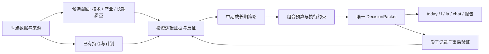

# 暮云融合决策架构：从多方意见到可跟踪的投资计划

> **当前入口（2026-10-02）：[长期里程碑](../../MILESTONES.md) → [当前状态](STATUS.md) → [恢复入口](RESUME.md) → [R14独立审批](iteration8/R14_ACCEPTANCE.md) → [第八轮O0–O2任务](iteration8/DELIVERY_PLAN.md)。N批分项接收、M2原型通过；K1未冻结、M2生产未放行、capture_only不变。**

日期：2026-09-25｜研究初查：`449bbfb` / v0.8.17；恢复核对HEAD：`bdebf13`｜状态：**设计交付 → F0–F9 已全部实施 VERIFIED**（v0.8.20，1121 tests；实施状态与证据见 [EXECUTION_RECORD.md](EXECUTION_RECORD.md)；**致架构师汇报与下一轮设计议题见 [ARCHITECT_REPORT.md](ARCHITECT_REPORT.md)**）。

两提交间仅`start.py`帮助菜单变化，本轮所查核心源码一致；已保留该外部改动。后续执行仍须复核最新HEAD与工作区。

本轮遵守用户授权：只做架构、研究、规划与验收设计，不修改产品源码、测试、配置或真实持仓。上一轮 M1–M6 / C1–C6 的实施记录保留在上级目录；本轮任务使用 F 编号，不能混记为旧任务已经完成。

## 1. 总架构判断

当前最限制能力的不是缺少一个更聪明的总评分，而是三套体系回答的问题不同，却共享模糊的“评分、等级、买卖”语义：

- **笨韭**擅长提出产业机会、识别业务相关性、建立持有理由；现有实现以超景气价值投机为中心，还不是完整的长期企业质量与估值模型。
- **暮云 scan / 技能引擎**擅长广泛筛选、识别价格与成交量状态、贯彻退出纪律；当日快照不能直接证明长期投资价值。
- **AI**适合提取公告事实、识别因果与反证、解释计划变化；自报置信度并不等于收益概率，同一条新闻也不能经过多层分析后算成多份证据。

融合目标是把它们放到各自最有价值的位置：**产业与公司逻辑决定研究资格，周期策略决定持有纪律，价格与成交量决定执行时机，组合约束决定风险预算，AI 解释证据变化。最终只产生一个带条件、可追踪的行动结论。**

“能力远超现在”是要验收的目标，不能在没有样本外验证时承诺收益改善。工程正确性、用户理解度可以先交付；投资效果按独立证据门槛发布。

## 2. 第一轮设计时发现的问题（历史基线，非当前缺陷清单）

以下为 v0.8.17 的研究结论；后续实施已改变若干代码路径。当前状态以实施账本和第二轮逐项复核为准，不能直接当作 v0.8.20 仍未修复的问题。

源码和隔离探针详见 [RESEARCH.md](RESEARCH.md)、[PROBES.md](PROBES.md)。关键结论：

1. **最终动作不统一**：人话摘要读早期 DecisionResult 与原始 entry_exit，证据卡混用早期 decision 与末端 position_action；隔离探针复现摘要与终态反向。
2. **分数语义混用**：决策 score 表示选定动作强度；AI 看空统一减分；排名又把高强度 SELL 映射成高“技术分”。不能再将它视为综合买入价值。
3. **持仓事实与建议边界需要优先重建**：`PortfolioManager.update_from_strategy_decision` 会将策略目标比例写入记录；chat/Web/TUI 分析后有该调用。必须先阻止“建议已卖”被当成“实际已卖”，再做组合决策。
4. **长期资格不足**：距三年低点涨幅不是企业估值，业务纯度不是盈利质量，A 级不等于适合长期持有；180 自然日是现有策略纪律，不能改名冒充长期模型。
5. **效果证据有限**：既有气宗案例支持继续研究持有纪律，却不能证明事前自动选股；规则代理与 AI 评分曾出现明显失配。
6. **市场适配有具体工作**：交易制度有日期变化；当日量比缺失时扫描会跳过该条件并告警，仍需机器可读的规则完成度；绝对成交额、统一跌幅阈值需跨市场规模、板块与波动水平验证。

## 3. 中期与长期同时服务

| 维度 | 中期计划 | 长期计划 |
|---|---|---|
| 主要赚什么 | 产业景气或盈利预期变化与趋势兑现 | 持续盈利、现金创造、合理买价及股东回报 |
| 研究尺度 | 数周至数月，具体由催化剂与逻辑决定 | 跨季度至跨年，具体由企业逻辑决定 |
| 必要证据 | 真实受益业务、催化剂状态、价格趋势、风险 | 多期财务质量、资产负债约束、经营优势、估值情景、风险 |
| 技术层职责 | 参与入场及趋势退出 | 控制入场成本与风险，普通日线噪声不直接否定长期逻辑 |
| 复核 | 新证据及计划内复核日 | 财报、重大公告及计划内复核日 |
| 退出 | 逻辑失效、事先选定的风险纪律、机会到期 | 逻辑失效、风险预算越界、估值或资金需求触发的再评估 |

这些期限是研究语境，不是到天数机械清仓的新参数。`horizon` 与气宗/剑宗 `legacy_mode` 分开。首版同一账户同一股票只允许一个已确认的持仓意图，同时支持不同股票分别中期与长期。可比较另一意图的研究结果，但不能分析时自动改变持仓意图；同股分仓台账留后续明确立项。

## 4. 用户最终看到什么

日常入口建议为 `today`：先处理已有持仓，再展示值得进一步研究的机会。第一页最多展示三张普通行动卡；重大风险不得因为卡片上限被隐藏。每张卡回答：

> **示例，非真实标的：继续持有，今天不加仓。**
> 长期计划仍成立；最新现金流证据支持，当前价格超过本计划加仓区间。
> 下次关注：新财报发布后复核；若出现预设的现金流恶化条件，提前复核。
> 数据截至……｜计划版本……｜展开依据与反证

又如：

> **示例：退出计划仍有效，当前无法确认可成交。**
> 已核实的退出条件触发；受停牌/跌停/可卖份额约束，尚未执行。
> 持仓记录保持不变，下一交易时段重新检查。

`l` 成为单股统一分析，`la` 复用持仓行动清单；`bz`、`scan` 保留研究与专家诊断入口。详细依据全部保存，默认视图只显示决定行动的关键证据、冲突和下一触发条件。chat 的语言不能改写底层动作、仓位与约束。

## 5. 架构与交付顺序

保持 Python 模块化单体。先用适配层包住现有引擎，再以纯函数策略逐步替换重复裁决；不引入微服务、消息中间件或大型通用图数据库。

| 阶段 | 内容 | 发布判据 |
|---|---|---|
| F0–F2：结论可信 | 冻结契约；实际持仓/建议分离；统一最终动作 | 所有入口终态一致；分析不改变已确认持仓；强制退出意图不丢失 |
| F3–F4：研究可信 | 时点证据、缺失语义、候选谱系、因子目录 | 无来源事实不进入强结论；规则完成度可查；可重放 |
| F5–F6：能力融合 | 中长期计划、证据型 AI、组合预算 | 两种周期均有完整条件表；冲突有唯一裁决；无虚假仓位精度 |
| F7：体验融合 | today / 单股 / chat / diff 同一行动卡 | 用户可快速回答做什么、为什么、何时改变；完整依据可展开 |
| F8–F9：效果验证 | 时点回放、消融、影子观察、受控启用 | 正确性与收益证据分别验收；未达效果门槛不替换默认策略 |

可先发布 F1–F2 的正确性改进，不要求等待数月收益验证；中长期新策略先以显式实验模式运行。执行顺序、文件所有权、验证命令见 [TASKS.md](TASKS.md)。

## 6. 交接阅读顺序

1. 本文件：产品目标与架构决定。
2. [RESEARCH.md](RESEARCH.md)：bz / scan / AI 现状、因子适配判断与源码坐标。
3. [MARKET_EVIDENCE.md](MARKET_EVIDENCE.md)：官方规则和研究文献，明确时点与外推边界。
4. [DESIGN.md](DESIGN.md)：数据契约、策略决策表、组合算法、AI 边界、迁移与缓存。
5. [VALIDATION.md](VALIDATION.md)：数据资格、实验矩阵、统计与用户验收。
6. [TASKS.md](TASKS.md)：执行任务与完成证据。
7. [PROBES.md](PROBES.md)：本次实际运行的隔离探针；[RESUME.md](RESUME.md)：中断恢复状态。

本次没有获取真实持仓的新行情、调用项目收费 AI、重跑大型回测或实施重构。未完成的生产验证不以设计文档代替。
