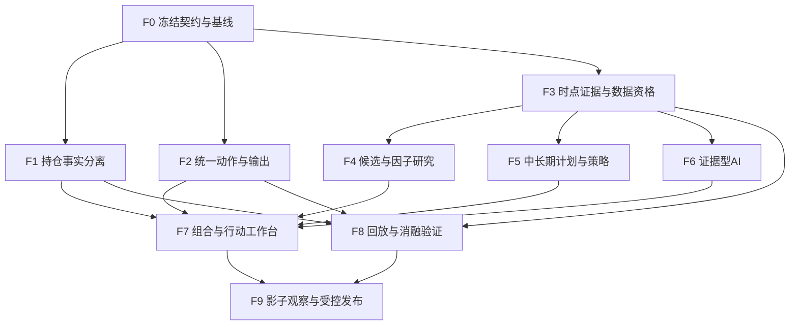

# 融合迭代任务与Agent交接

2026-09-25 第一轮原始任务卡（保留原验收条款）。实施方已在 [EXECUTION_RECORD.md](EXECUTION_RECORD.md) 记录 F0–F9 VERIFIED；2026-09-26 架构师作出[有条件验收](iteration2/README.md)，未满足的原始条款及新增能力由 [R0–R9](iteration2/TASKS.md) 承接。本文不是当前 TODO 清单，也不因实施报告更新而删除原验收要求。

## 协作规则

- 开工读AGENTS、CLAUDE、工程纪律技能、本目录README/DESIGN，以及相关源码；旧ISSUES和记忆是线索，不自动当作当前事实。
- 每个任务只有一个文件主责。共享`models.py`、`orchestrator.py`、`main.py`、`start.py`、配置、AGENTS的接线由集成负责人串行完成；其他Agent先交模块与契约。
- 每位执行者都不是独占代码库，不回退他人修改，适应已经合入的接口；开工和完成都记录git基线。
- 建议并行职责：数据研究、纯策略、展示、验证可以在F0冻结契约后独立工作；实际是否启动Agent由用户/当前任务授权决定。
- 每项状态：TODO→IN_PROGRESS→REVIEW→VERIFIED。代码写完只能到REVIEW；必须有验收证据才到VERIFIED。删减验收条款要新ADR，不得以“实现成本太高”自动标完成。
- 不修改真实portfolio、密钥、Claude配置、备份、知识索引；测试隔离home，真实外源/AI单独显式运行并记账。

## 依赖图



F8测试基础可提前；涉及F4–F7的效果实验等待相应模块交付。不按日历承诺“若干天证实长期策略有效”。

## F0 — 契约、基线与参数登记

**主责**：集成负责人。**文件**：新增`src/core/decision_contract.py`、`tests/core/test_decision_contract.py`；设计执行记录。暂不改策略参数。

工作：实现DecisionPacket/EvidenceRef/ResearchStatus等最小类型，明确百分比单位、target与delta、时区与证券ID。冻结legacy回放集、风险不变量、相关调用矩阵与配置hash。对RESEARCH中的可疑调用链复核最新HEAD，尤其持仓回写和摘要。

验收：非法动作/仓位组合有明确校验；UNKNOWN与MISSING不被转换为0；JSON往返稳定；给出BUY/WAIT/HOLD/EXIT受阻四份样例。记录每个现有分数字段的语义与来源，不改变其历史含义。

交付：契约、样例、consumer清单、基线报告。**回滚**：尚无行为切换，删除新入口即可，历史文件不变。

## F1 — 已确认持仓与分析建议分离（最高优先）

**依赖**：F0。**主责**：持仓负责人。**文件**：`src/data/portfolio.py`、新建议/成交记录模块；`tests/core/test_portfolio_observation.py`、`test_confirmed_fill.py`。chat/Web/TUI/CLI接线交集成负责人。

工作：拆观察量更新、建议存储、用户成交确认；保留旧pos录入方式。把建仓/清仓驱动的生命周期变更延迟到实际确认；分析生成的new_state不整包当真实持仓回写。定义旧记录LEGACY_UNVERIFIED迁移，保留未知字段。持久化需串行写锁+版本冲突拒绝。

验收：临时持仓20%→建议EXIT且execution受阻，记录仍20%且成本/日期不变；用户确认部分成交才减仓，重复确认幂等；双实例冲突不吃更新；所有分析入口都不能伪造持仓；同日重复分析不重复推进交易日计数。给出用户可见的“这是建议，尚未记为成交”与确认后变化。

迁移：dry-run列出旧记录解释；不自动“修正”用户数字。**回滚**：可回到旧策略建议，不能恢复分析自动当成交。

## F2 — 最终裁决与所有输出一致

**依赖**：F0；写入路径依F1。**主责**：集成负责人。**文件**：`orchestrator.py`的结果适配、新`analysis_service.py`、`action_view.py`、`cli/evidence.py`；串行接`main.py/start.py/chat/formatter.py/chat/tools.py/web/tui`。

工作：先不改投资参数，以末端Strategy+Execution构造DecisionPacket；保留原始信号作诊断。行动摘要、watch准入、证据卡、diff、排名消费明确的终态/研究资格。BUY机会榜与持仓风险榜分开。AI score语义问题独立小批修复：明确direction/strength，禁止看空消息降低卖出强度或二次计入技术分；改变行为的部分要A/B，不能混同等价适配。

验收：PROBES A/B转真正的PlanGuard与Execution接线回归；所有强制退出路径与压制路径覆盖；行情同快照各入口输出相同终态；SELL强度不再被当买入吸引力。原buy/sell路径原因仍可查，legacy安全网不退化。

**回滚**：统一输出与事实修复保留；新AI调节语义可单独关闭至legacy对照，但不得把歧义分数用于新决策。

## F3 — 证据快照与时点数据资格

**依赖**：F0。**主责**：数据负责人。**文件**：`src/data/research_snapshot.py`、现有数据provider的窄适配、`tests/core/test_research_snapshot.py`；数据契约与覆盖报告。

工作：先支持行情、官方公告、财务三类，不重建所有数据层。source_uri/hash、published/available/fetched/period_end、单位和版本贯通；证据异常/过期/未知分开。建立关键财务与分部信息的真实可得性矩阵，发现不足则缩小首发行业范围并明示。

验收：未来公告和后发重述不进入旧快照；元/万元及累计/单季口径可验证；删必需字段后资格变INCOMPLETE；RAG方法文本不当公司事实；同快照重放稳定；回测路径零实时网络。

**回滚**：适配器旁路，新证据保留；缺字段不补假数据。源故障需遵循告警三处同步纪律。

## F4 — 三路候选与最小因子包

**依赖**：F3。**主责**：候选研究负责人。**文件**：scanner的CandidateSet适配、新因子登记文件、bz研究适配；尽量不动旧scorer公式。测试拟`tests/core/test_candidate_lineage.py`。

工作：技术/产业/质量候选取并集去重，保留source、rule_version、applied/missing filters、rank completeness和截断原因。快照缺量比的候选标待验证，不宣称缩量。旧六维按原口径显示；新版独立记录价格位置/真实估值/经营景气/市场热度，避免加一个含糊综合分。

验收：多渠道同股只计算一次；候选来源配额不会因输入顺序变；长期候选不受当天回调必要条件误杀；同研究预算比较召回效果；不新增龙头偏向，不把所有小盘按历史论文一刀切删除。

**回滚**：新候选路线关掉，旧scan/bz命令可用；候选证据记录保留。

## F5 — 中期与长期PlanV2和纯策略

**依赖**：F0/F3；接账户依F1。**主责**：策略负责人。**文件**：`src/core/research.py`、`decision_policy.py`、trade_plan侧挂适配；`tests/core/test_horizon_policy.py`。

工作：实现DESIGN周期决策表与结构化失效条件；明确UNKNOWN与FALSE；加入财报/事件/日期复核而不是把review_due变强制卖。legacy气宗180自然日、阶段双实现、Chandelier保持原行为。新增策略ID，不用旧mode代替horizon。

验收：同股票同证据不同周期结果可解释；中期逻辑失效不能自动延长期限；长期短期技术噪声不触发未约定退出；长期缺财务不发质量合格结论；新计划需确认后才激活；未支持行业明确限制。旧计划零写入即可继续读取。

**回滚**：shadow/opt_in可关闭，版本对象保留，不反写旧计划或删除历史。

## F6 — AI事实提取、反证与解释

**依赖**：F3/F0。**主责**：AI负责人。**文件**：证据提取适配，`ai_modifier.py/event_layer.py/benzong`调用边界，chat解释与RAG引用；与F2共享文件由集成负责人合入。

工作：统一事件谱系；结构化claim及引用核验；分清OBSERVED与MODEL_INFERRED；先评测可合并的多维提取调用。expect/events共用ID，fear只作环境字段。冻结小型人工标注集，覆盖错误实体、旧闻重炒、财报更正、上下游影响相反、缺证据和注入文本。

验收：不凭LLM自报confidence加仓；非法引用拒收；重复新闻不重复计票；无AI时模板行动卡可用；同输入不重复付费；比较提取正确率/重大风险漏检/事实捏造/费用与耗时。不得以换更大模型代替缺数据治理。

**回滚**：停用新AI模块，保留确定性事实与风险输出；不要填“中性看好”掩盖失败。

## F7 — 组合预算与统一行动工作台

**依赖**：F1–F6。**主责**：组合/展示负责人；共享入口由集成负责人接线。**文件**：`portfolio_policy.py`、action_view、today服务及入口；`tests/core/test_portfolio_policy.py`、UI集成测试。

工作：同快照批量分配风险预算、现金/个股/行业/周期约束；目标比例单位统一。推荐与实际成交分离，未知资金不发精确股数。today优先持仓风险，普通卡少量展开，硬风险全部可见；l/la/chat复用同一包；专家详情完整保存。

验收：资金不足时只给可行计划；卖不出不得提前花卖出现金；同主题风险合并；排列不变性；持仓版本变更使缓存失效。完成VALIDATION八类用户任务走查并记录误解，尤其“受阻退出”不能看成“继续看好”。

**回滚**：可关新首页，统一终态与持仓事实仍保留；旧命令兼容。

## F8 — 严格回放、制度模型与消融报告

**依赖**：F0–F3先启动，E1–E7等待对应模块。**主责**：验证负责人。**文件**：`backtest_engine.py/execution_layer.py`的窄适配、新实验脚本/manifest/报告；不动策略训练参数。已有DataFeeder等价基准不得删除。

工作：按生效日规则、精确限价与T+1份额、税费/数量单位/末日估值核对成交模型；保留历史live禁网门控。构建固定组合资金的回放，不能把多只独立满仓回测均值叫可投资组合。完成VALIDATION的E0–E7及数据资格/统计要求。

验收：离线重放可复现，未来数据探针红灯，成本加大不会无解释提高净收益；场景覆盖IPO/停牌/一字板/除权/分红/退市/财务修订；输出基线差、sell_path、成交阻塞、分层结果与失败实验。严格区分规则bz代理、AI前瞻输出、人工mode案例。

**回滚**：保留legacy回放模式供诊断，不用它掩盖新严格模式暴露的收益差异。

## F9 — 影子运行、验收与简化

**依赖**：F7/F8。**主责**：架构验收负责人。**文件**：实验开关、执行记录、用户手册、回滚说明；源码改动仅清理经证明无消费者的重复分支。

工作：capture_only→shadow→opt_in→default按门槛推进。先收集同日数据完整性与动作差异，再长期跟踪净值、未成交、AI费用与人工覆盖。达到正确性但未达到投资证据门槛时，只发布相应能力，不声称融合策略已经胜出。

验收：所有入口覆盖、数据与规则版本可追踪、风险事件无静默吞掉、性能基线有实测；中长期分别出效果结论。删除重复裁决必须有消费者扫描与回放等价/预期差证据；不以删行数为成功指标。

## 验证命令约定

以下测试文件名是拟新增，不声称当前存在。每个实现任务完成时替换为实际路径并保存输出：

```powershell
.\.venv\Scripts\python.exe -m pytest tests/core/test_decision_contract.py -q
.\.venv\Scripts\python.exe -m pytest tests/core/test_horizon_policy.py -q
.\.venv\Scripts\python.exe -m pytest -q
```

真实接口、PIT数据建库、AI评测、大型回测均单独入口且有manifest，不能混进默认pytest或在用户真实home运行持久化测试。此前记录811 passed是旧实施批次报告，不是本轮新测试结果。环境失败与产品回归失败分开登记。

## 执行记录模板

```text
任务：F__ / 实现者 / 审查者
基线提交：
文件所有权与实际改动：
已完成条款：
未完成条款（保持TODO，不自动删除）：
数据/配置/模型版本：
红灯→绿灯证据与命令：
同类调用点扫描：
用户可见变化：
收益实验（若适用）及局限：
迁移/回滚验证：
状态：TODO / IN_PROGRESS / REVIEW / VERIFIED
```
