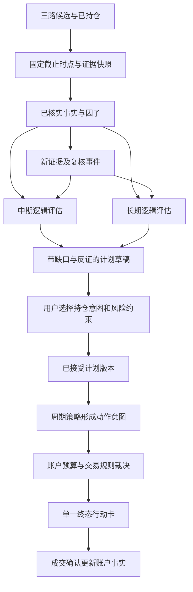

# R3–R6/R8 自动研究、双周期计划与行动闭环

2026-09-26｜设计提案，未实施｜前置 [DATA_TRUST.md](DATA_TRUST.md)。保持模块化单体，复用 DecisionPacket、任务账本、证据库和已有命令。

## 1. 核心产品变化：系统完成研究，用户选择意图

现状是用户先写 `plan2 --facts`，系统才有机会认为逻辑已建立。目标是输入代码或扫描主题后，系统自动形成有来源的研究草稿；用户只需选择自己认可的持有意图和风险约束。数据不足时系统具体说明还缺哪项，而不是让用户编一句事实解除门禁。

一条研究链只由一个服务编排：



建议新增窄服务 `src/core/research_service.py`，输入 `security_id, as_of, horizons, research_budget, account_ref`，输出 `ResearchBundle`。CLI/chat/Web/TUI 调同一入口；纯研究模块不直接 print、读用户 HOME 或建 AI client，IO 和依赖由服务注入。

`ResearchBundle` 最小字段：run_id、snapshot_id、source_document_ids、claims、factors、assessments[MID/LONG]、plan_drafts、gaps、next_checks、cost_summary。**研究包不是第二个 DecisionPacket**：只含研究结论，不另定义最终买卖动作、仓位和执行状态。

### 增量与失败恢复

复用批量任务账本，步骤为 snapshot→extract→verify→factor→assess→draft；每步以输入内容 hash+实现版本缓存并记录状态。超时保留已完成事实，不能把残缺结果标 COMPLETE。变更事实只使依赖它的命题和草稿失效，不重新跑全部 bz 维度/公告分析。分析同一股票的两个周期共享抓取与提取；仅命题评估、计划边界分别计算。

## 2. 从文字列表到可验证命题

在 `research.py` 内收敛资格判断，禁止 shadow/CLI 另写“非空即 VALID”：

```text
ThesisAssertion
  assertion_id, security_id, horizon, thesis_version
  proposition_type, description, importance(required/supporting)
  evidence_requirements[], supporting_evidence_ids[], counter_evidence_ids[]
  evaluation(TRUE/FALSE/UNKNOWN), evaluation_rule_version, evaluated_as_of

ThesisAssessment
  thesis_id, horizon, snapshot_id, status
  required_assertions[], unresolved_gaps[], material_counter_evidence[]
  invalidation_results[], next_checks[], method_version
```

TRUE 表示该命题在冻结证据和方法下被支持，不是未来一定兑现。`ThesisStatus.VALID` 的含义是“当前关键命题达到约定证据资格、尚未被失效条件推翻”，**不能翻译为盈利确定或胜率高**。

优先级：已核实的预设失效条件成立→INVALID；关键反证未核实/来源冲突/到期缺关键资料→REVIEW_REQUIRED；必需命题无法建立→UNESTABLISHED；全部必需命题达标且无未解决的重大反证→VALID。硬风险退出保持独立优先级，研究不完整不能阻止已知硬风险上报。

用户输入事实登记 USER_ASSERTED；可以保存注释或形成待核查任务，但不能因点击 accept 就变 FACT_CHECKED。允许明确标识的人工辅助研究模式，必须保留人工输入者、时间、来源和采用限制，独立于自动研究样本统计。

### MID 最小命题

1. **真实受益**：公司哪个业务受益，暴露依据是什么；仅概念标签不达标。
2. **变化与兑现**：需求/价格/订单/供给变化如何进入收入或利润，当前处于预期、签约、交付还是财报确认阶段。
3. **时窗与反证**：在何时验证、什么事实出现会推翻、到期未兑现如何处理。
4. **价格与容量背景**：趋势、相对行业表现、流动性及已经反映多少预期的可解释代理；此项不能自动证明经营命题。

bz 六维拆为假设与证据引用：景气/纯度/壁垒/驱动等对应命题；原 Excel 保真评分及 effective_grade 保留专家视图，但不直接赋予 MID 资格或最终仓位。当前事实不足以计算真实业务暴露时明确缺口，不能由主题 AI 列表补成事实。

### LONG 最小命题

1. **盈利与现金创造持续性**：多期而非单季；解释资本开支、营运资本和一次性项目。
2. **资本与资产负债约束**：回报来源、杠杆、融资/稀释、偿债和治理风险。
3. **经营优势可持续**：有可查证经营事实支持，不能由品牌形容词或技术走势替代。
4. **估值区间及反向假设**：当前价隐含什么盈利/回报假设，悲观/基准/乐观情景由哪些数值决定。
5. **长期失效条件及复核节奏**：经营证据变化与资金需求可触发复核，普通日线回撤不单独推翻企业逻辑。

原设计 12 季/3 年作为首个普通非金融企业模型的研究覆盖目标，达不到时明确缺口；它不是任何行业皆有效的充分条件。首版自动 LONG 仅对经验证的普通非金融、非专门周期模型适用。银行/保险、强周期、持续亏损、复杂重组等归专门研究；不得按普通 PE/杠杆阈值判劣后强行排序。**能力边界要可见且保留机会，不能把“不支持”显示成“不值得投资”。**

## 3. 因子要有机器可辨的经济含义

`factor_registry` 登记、`factor_compute` 计算继续分离。扩展 `definition_id/version, capability, sector_scope, required_inputs, time_basis, missing_policy, upstream_ids, parameter_set_id`。返回非空数字不代表满足某个研究能力。

| 当前计算 | 第二轮处理 | 能支持什么 | 尚不能支持什么 |
|---|---|---|---|
| roeAvg 作为 capital_return | 独立 `roe_observed_v1`，ROIC 原能力保持 UNKNOWN | 股东账面资本回报的来源分析线索 | 未调整杠杆与回购的跨行业资本效率排名 |
| CFO/净利润 | `cash_conversion_v1`，明示期间、负分母/接近零分母 | 利润现金转化的部分证据 | 单比率替代全部盈利质量、亏损时机械高分 |
| current/quick/liability ratios | 独立分量，带单位可信状态与行业适用性 | 资产负债风险线索 | 缺债务到期结构仍称偿债风险完备 |
| trailing PE | `pe_ttm_v1` | 当前价格/已报告盈利倍数 | 用 `valuation_range_v1` 冒充估值区间 |
| 个股收益减行业收益 | 日期对齐的 `relative_return_v2` | 同窗相对趋势 | 无行业历史成员资格的严格历史行业超额 |
| 交易额/20日均额 | 带规则/行情时点的容量代理 | 拟交易规模的粗容量约束 | 已知可成交；停牌/涨跌停/份额仍需独立检查 |

相对趋势输入改为带交易日期序列：统一截止日和起始日，声明停牌缺 bar 与指数正常交易日如何处理；对齐失败 UNKNOWN。禁止两条不带日期的数组各取最后 61 项就声称同窗。窗口 20/60/120 等如需比较须先登记为候选实验，默认不因一次结果更好就替换。

首版估值场景支持可解释的简单模型：正常化盈利区间×适用倍数区间/一致股本，或在现金流和必要投入足够时用明确折现假设的现金流情景。必须披露假设来源、适用行业、区间与敏感性；无可靠输入就不产买入区间。不能为消除 UNKNOWN 自动编利润增长率。用户可调整假设形成新版本，保持系统草稿和用户修改可区分。

市场环境 `fear`、成交额等只改变事先登记的风险情景/研究优先级，**未经验证不自动改质量资格或长期估值**。固定 70% 杠杆、固定成交额档、60 日涨跌等旧阈值保留 legacy 诊断，进入新策略须有参数卡：经济假设、适用范围、信息时点、参数冻结与样本外结果。

## 4. 计划：共享事实，分别研究，一个持仓主意图

`HorizonPlan` 关联 `assessment_id, snapshot_id, policy_version, created_at, supersedes_ref`。接受操作绑定精确的 plan_id+revision+content_hash；草稿改变后不能沿用旧接受状态。

存储建议在原 `horizon_plans.json` 版本升级中保留 `versions`、`latest_draft_refs`、`accepted_refs`，另由账户状态维护 `active_holding_plan_ref(account, security)`；不需要新建独立微服务。历史只追加，移除是 tombstone。读取旧 plan 时转 legacy_import，保留 facts 文本但评估为待核实，不能自动激活新的融合主决策。

- 同股 MID/LONG 草稿和研究评估都可存在。
- 已接受研究计划可以有两份，但真实持仓主意图只有一份；另一个标“比较方案，不驱动持仓动作”。
- 改成 LONG 展示新资格、失效条件、仓位/复核变化；不得因为亏损或 MID 触发退出自动转换。
- 明确发生在新周期的事实仍可复用，但支持哪条命题要重评。
- 首次建仓、已有持仓、全部退出后再建仓都需要有清晰 active ref 生命周期；不得沿用旧轮持仓的接受状态。
- 一次写事务覆盖版本校验和写入。原子 rename 不等于并发 compare-and-swap；若多个进程支持写入，采用同一路径文件锁或单写入者。测试两进程争用，不用“通常单进程”替代边界保证。

## 5. 从动作意图到可执行建议

周期决策表输出 **PolicyIntent**（内部值对象：desired_action、reason_codes、计划目标、证据引用），不是直接可展示的另一个终态。现有 evaluate_horizon 的兼容返回由适配器暂收敛；最终只有组合/交易规则完成后生成 DecisionPacket。新实现不得把中间 ELIGIBLE 透传为已通过全部执行门。

顺序：已知硬风险→逻辑失效→周期纪律→研究缺口→入场条件→预算→执行规则。目标退出但当前受阻时保留 EXIT + BLOCKED/UNKNOWN。新增仓位须资格、有效接受计划、现金/容量/规则均满足；分析仍然不改真实持仓。

### AccountSnapshot

最小字段：account_id、as_of、currency、cash_available、cash_reserved、holdings(quantity/cost/lot_acquired_at)、NAV 及定价时点、data_completeness、version。百分比仓位旧数据只能支持“权重假设视图”，不能悄悄推成确切数量/可用现金。

现金输入采用用户一次录入或已授权导入；确认实际成交按数量、价格、费用更新。存取款/分红/费用是独立事件，不冒充股票收益。SELL 建议不增加现金，实际确认并按结算规则可用后才可分配；不得在现金已更新后再次加 sell_eligible_nav。

现金或数量缺失：仍给 HOLD/风险/研究结论，新增动作保持 CONDITIONAL/UNKNOWN；显示“尚缺可用现金，不能计算可买数量”，只问这个阻塞字段。**理论上限可展示为研究假设，但不得叫‘可买额度’。**

### 预算与离散交易约束

保留 solve_budget 的确定性连续约束分配，明确输出为 indicative allocation；新增薄层 `allocate_tradeable_budget`，消费账户快照、日期/板块/证券交易规则、行情/费用、候选意图：

1. 按固定优先级分配预算上限，计算含费用的可承担数量。
2. 按生效交易规则向下取到合法申报数量/递增单位；不全市场硬编码 100 股，卖出零股规则独立。
3. 检查可卖批次、停牌、价格限制、容量等；未知不等于可成交。
4. 数量为零则不占预算，给“一笔最低合法申报所需资金仍不足”的明确原因；释放余额按稳定顺序有限次再分配。
5. 对最终离散结果重新检查现金、单股、行业、周期及压力损失约束。浮点误差不借此突破上限。
6. 返回 allocation_state=FEASIBLE/CONDITIONAL/REJECTED，以及每条约束的来源/生效日期；FEASIBLE 仍是满足已知规则的提案，不保证市场成交。

每条压力损失参数有估计截止日、窗口/场景、方法版本；不取未来全周期最大回撤。压力预算计入**已有持仓+拟新增**的整体暴露，不仅新买。风险输入不全时显式降为用户限定的简单资金预算模型，不能拿任意非空数字绕过压力闸门再称完成风险控制。涨价造成的被动超配与买入时超限分别处理：前者生成再平衡复核，不能篡改为当时违规成交。

## 6. 用户界面和其他功能的统一

保留 `l`/`la`/`today`/`scan`/`bz`/`watch`/`diff`，新增操作优先挂现有命令子项。以下是待实现交互，不是现在已支持的命令。

### 新候选

`l <code>` 无主计划：显示中期/长期各一句资格结论和理由，自动保存草稿；只有达到资格且需要用户选择时出现一个选择。默认不要求用户手写 --facts。

> 示例：中期逻辑有待验证，长期研究暂不完整。订单已签约，利润贡献尚待确认；长期还缺资本开支与估值情景。今天先观察，下次检查季度披露。已有来源 3 份，待核对 1 项。

### 正常长期持仓

> 示例：继续持有，今天不加仓。长期逻辑未变，当前价格高于计划加仓区间。下次复核：新财报，或现金流失效条件触发。

未改变动作的重复信息折叠到详情；每条逻辑有到期/事件触发器，不能永远 HOLD 而从不复核。

### 中长期冲突

> 示例：按当前中期计划减仓。趋势退出条件已满足；长期方案仍缺估值验证，不能自动接管这笔持仓。查看两种计划的差异。

### 退出受阻

> 示例：退出意图保持，当前可卖份额不足。本次持仓数量没有变化；下一交易时点复查可卖数量。

卡片同时保存 desired 与 execution，不用“建议持有”掩盖受阻退出。已持仓且可靠硬风险触发时，不因缺新研究而隐藏风险。

### 预算不足

> 示例：符合研究条件，暂不新增。现有可用现金不足本证券最低合法申报所需金额；不占用预算。满足资金条件后再复核价格与资格。

### 功能接线约定

| 入口 | 统一消费 | 不再各做什么 |
|---|---|---|
| scan/bz scan | CandidateSet + 路线来源 + 未完成条件 | 不把召回排名直接翻译成买入排名 |
| bz/ba | 带原始方法的专家诊断，可引用到 ResearchBundle | 不以 A 级覆盖长期研究缺口 |
| expect/events | 同一事件谱系的 EXPECTED/OBSERVED/REVISED 状态 | 不把同事件在多个模块重复加分 |
| fear | 环境证据/已登记风险情景 | 不单独投买卖票 |
| watch | WaitingCondition + next_check + 关联草稿 | 不只有入池收益表，无触发条件 |
| diff | 两次终态、命题状态及影响动作的证据变化 | 不以全文重新摘要冒充变化分析 |
| chat | 同一 service 和 DecisionPacket，解释不改变动作 | 不绕过资格/预算/确认流程另裁决 |
| today | active holding plan 对应的终态，已过期/待复核/受阻优先 | 不并列三个互相冲突的总评分让用户猜 |

第一页普通行动卡最多三张，所有重大风险保留可见入口和数量。展开能看到来源、原文、反证、参数版本、被阻条件与具体时点。未知数据缺口影响行动才优先问用户，其余由系统后台任务/下一次分析补齐；不为每一条抓取失败弹问题。

## 7. 精简代码的实施边界

新增的是研究服务、必要证据模型和窄适配，不重写七层架构。先统一 assess_thesis、最终 DecisionPacket 生成、计划版本选择、预算适配四个单一入口，再清理 shadow/CLI/chat 中重复判断。删除条件：消费者扫描、覆盖反例的测试、预期行为差报告同时具备。

legacy 作为过渡比较实现保留，不应无限期保留两套默认裁决；R9 对每条旁路记录删除前提与退出计划。暂不能删除的模块解释具体消费者，不以“将来可能有用”留下兼容壳。模板解释可离线完成，长文 AI 解读是可选成本，不是使用工具的前置条件。
