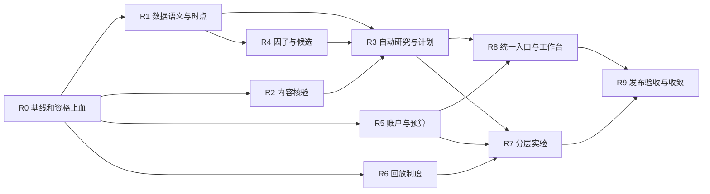

# 第二轮实施任务卡 R0–R9

2026-09-26｜基线 `5b2e262`｜**全部 TODO，本文件不是完成报告**。架构师本轮仅交付设计，执行 Agent 在其已获授权的实现任务中按此开展工作。

## 协作与验收纪律

- 开工读 AGENTS/CLAUDE、工程纪律与相关记忆、[本轮裁决](README.md)，核对当前代码与工作区；行号是线索，不是事实源。
- 每个任务一个主责；执行者不是独占代码库，不回退其他人修改。共享 `main.py/start.py/orchestrator.py/settings.yaml/decision_contract.py` 由集成负责人串行接线，先提交窄接口设计再落代码。
- 不修改真实 portfolio、密钥、Claude 配置、备份、知识索引。测试使用隔离账户/HOME；AI/网络实验单列预算和显式运行入口。
- 状态 TODO→IN_PROGRESS→REVIEW→VERIFIED；VERIFIED 只能用于该卡所有验收条款，缺一条写 PARTIAL 并保留剩余项，不以“技术上已接通”收口。
- 保留历史 F 账本，另建本轮执行账本；按 [VALIDATION](VALIDATION.md) 五个维度报告。延期、缩减验收需写明架构偏差，不能在同一张卡自己删标准后称完成。
- 每次交付含真实入口可见变化、对应反例测试、离线全量检查（按仓库 L05 记实际口径）、必要外源验证。新增 warning 同步项目要求的三处。
- 不为文档任务增加源码测试；涉及行为的卡用有判别力的反例与端到端场景。禁止测试只复述实现内部常量。

## 依赖与主责表



| 卡 | 主责模块 | 可独立工作 | 初始状态 |
|---|---|---|---|
| R0 | 版本/报告口径、最小资格阻断、后续契约 | 最先串行 | TODO |
| R1 | financial_data / research_snapshot / 原始采集存储 | R0 后，与 R2/R5/R6 分文件 | TODO |
| R2 | claim_extraction / claim_llm_extractor / 标注评测 | R0 后 | TODO |
| R3 | research / research_service(新) / horizon_plans / decision_policy / shadow_diff | R1/R2/R4 接口冻结后可用夹具起步 | TODO |
| R4 | factor_registry / factor_compute / candidate_pool | R1 契约后 | TODO |
| R5 | portfolio / proposals / portfolio_policy / account adapter | R0 契约后 | TODO |
| R6 | experiment 内 Replay / 交易规则与公司行动适配 | R0 后 | TODO |
| R7 | 实验脚本、manifest与报告 | R6 合入后接管 experiment 元数据部分 | TODO |
| R8 | today_service、CLI/chat/Web/TUI 串行集成 | R3/R5 接口后 | TODO |
| R9 | 独立验收、模式控制、文档与消费者清理 | 上述完成后 | TODO |

以上是可分工设计，不表示当前任务已启动子 Agent。

## R0｜冻结基线与资格止血

**目标**：在大功能开发前，先防止现有旁路输出被误用为生产资格。

**主责**：`plan/fusion` 交付/实验状态文件；`research.py`、`shadow_diff.py`、`research_snapshot.py` 中下述最小阻断由集成负责人一次完成，之后交还 R1/R3；配置文档不虚构已存在开关。

**实现**：记录 HEAD/dirty tree 与现有外部变更；新建 `iteration2/EXECUTION_RECORD.md`（实际开工时）。给 latest-only 证据增加临时保守资格识别；任何无可解析证据引用的 plan facts 不可使 thesis VALID；shadow 逐周期标来源。新字段正式版本在 R1/R3 替代临时门，不能两套长期共存。修正文档的 E0 等价/E1“原始并集35”/E7全路径等扩大措辞，保留旧数值与原始运行文件。

**验收**：

1. 本轮探针中的无依据逻辑与 latest-only strict 反例不再被升级；有效 legacy 主流程仍正常。
2. 同股仅 MID 接受时，LONG 影子明确模拟且不计真计划样本。
3. 用户看到具体“事实未核实/版本不可追溯”而不是笼统系统错误；旧事实文本、历史计划与报告保留。
4. 契约变更有兼容读策略，R1–R6 文件主责确认，无并行覆盖。

**退出条件**：只关掉整个研究系统或只修改报告标题不算完成。安全资格门不能随策略回滚撤销。

## R1｜财务语义、历史版本与可追溯快照

**主责**：`src/data/financial_data.py`、`src/data/research_snapshot.py`，必要的窄存储文件；`tests/core/test_financial_data.py` / `test_research_snapshot.py` 及显式 data_sources 探针。详设 [DATA_TRUST](DATA_TRUST.md) §1–3/§5。

**实现**：版本可得性分级、字段级单位/流量存量比率TTM、原始内容归档、SUSPECT 与依赖失效传播。ISS-114 以原始财报和同范围数值核实，不自动×100。采集支持幂等、失败恢复；行情/行业版本也保留截止资格，不将当前行业回填历史。

**验收**：

1. latest-only+旧pubDate 不进 strict；今天下载的可验证原始历史文档可以按真实公开日进历史快照。
2. 同期修订后，旧快照内容hash不变；新快照能解释修改来源和时点。
3. 不同类别字段使用正确时间基准；比率累计差分被拒；TTM 与 YTD 不混。
4. 单位异常、真实经营突变、缺失零值各有反例；异常仅隔离相关派生值，不冻结全产品。
5. 纠错能列受影响因子/计划/实验；旧已确认成交保持不变。
6. 至少用正常公司与 ISS-114 涉及样本的原始资料验证字段定义，网络失败登记而非替换成 fixture 假称实测。

**可见交付**：分析卡可见财务证据资格和具体缺口；DATA_COVERAGE 与当前能力一致。

**暂停点**：数据源缺历史版本时，严格 E2/E4 保持阻断；允许交付当前研究及前瞻采集，不能把限制“接受掉”。

## R2｜可定位原文的事实核验与 AI 评测

**主责**：`src/core/claim_extraction.py`、`claim_llm_extractor.py`、相关 tests/core 与 `tests/ai_eval/` 的核验语料；R7 的 E5实验调用这些接口，不复制核验逻辑。

**实现**：分级核验、正文定位、显式 as_of、数值/否定/阶段与归属检查；AI 支持关系与事实分离；缓存版本化，失败/拒识/截断成本留痕。历史 f6v1/v2 标签和结果保留，新协议单独命名。

**验收**：

1. 有真实hash但正文不支持主张时不能进入 FACT_CHECKED；无pool/无正文不能声称引用和内容已核实。
2. 空白、错公司、100倍单位、否定丢失、框架意向当收入、后发更正、注入指令有明确预期与回归。
3. 回放截止前后相同主张资格不同，不依赖机器当前日期。
4. 无AI可完成确定性研究与模板解释；两个周期重复调用同文档不重复付费。
5. 扩展语料先冻结后运行；报告 precision、覆盖、正确/错误拒识、关键事实错误及实际成本，不只一个通过数。

**可见交付**：用户能从“订单已发生”等事实打开原文位置，看到事实与研究解释的区别。

**暂停点**：正文不可得/语义复杂时保留 NEEDS_REVIEW；不能用第二个 LLM 自报认可替代核验。

## R3｜自动研究服务与双周期计划版本

**主责**：`src/core/research.py`、建议新增 `research_service.py`、`decision_policy.py`、`shadow_diff.py`、`src/data/horizon_plans.py`，相关测试；CLI 接线交 R8。

**实现**：共享 ResearchBundle、命题级评估、增量任务缓存；自动起草 MID/LONG，plan版本与接受状态绑定，账户主意图引用。研究评估唯一入口，去掉 shadow 的自写非空判断；按周期记录配对输入/来源。依赖 R4 因子能力而不是只检查值非空。

**验收**：

1. 不填 --facts 也能用冻结可信资料生成完整草稿；缺关键资料则生成带具体缺口的草稿，不能强行 VALID。
2. 同一事实同时服务中长期；两边必需命题不同，MID VALID 不使 LONG 自动 VALID。
3. 未核实重大反证→REVIEW_REQUIRED；核实失效条件→INVALID；技术反弹不能覆盖后者。
4. 用户接受精确版本，新事实只能生成评估/修订草稿，不能自动修改已接受风险界限。
5. 同股一个持仓主意图，切换保留旧版及差异；重新建仓不能沿用旧轮持仓授权。
6. 分析重试幂等，失败恢复；两进程同时改计划不丢更新；新版本存储损坏有保守读取与明确错误。
7. 中间策略意图与最终执行资格区分，缺预算的影子不能称可执行精确仓位。

**可见交付**：一次单股研究即有中长期比较、系统草稿、待验证节点；不用用户编事实解锁。

**回退**：退到旧主策略，保留全部新研究和计划版本；不得恢复非空事实自动 VALID。

## R4｜真实因子能力、日期对齐与有预算的召回

**主责**：`src/core/factor_registry.py`、`factor_compute.py`、`candidate_pool.py`；扫描/主题调用的薄适配先交接口，由 R8 接线；相关纯函数测试。详设 RESEARCH_LOOP §2–3、VALIDATION E1b。

**实现**：ROE/PE代理独立ID、长期资格按能力匹配、窗口/行业/财务定义版本；相对趋势按日期对齐；候选原始/去重/配额集合分开；法C分片、截断与成本预算。保留 bz Excel 保真，改评分逻辑时按项目纪律 bump CACHE_VERSION。

**验收**：

1. 单点PE不能满足 valuation_range 要求；ROE不能自动满足 ROIC；所有缺失/不适用状态贯穿资格。
2. 停牌造成数组长度相同但日期不同，不能得到伪同窗结果；无历史行业标签不能宣称 strict。
3. 财务负分母/接近零、一次性收益、行业不适用有测试；不编缺失估值输入。
4. 报告原始130、配额后35这类差异可机器核对；相同规则缺字段时明确完成度，不作为成功执行全部过滤。
5. AI分片失败保留已核实实体及覆盖缺口；请求/重试不超过冻结预算。

**可见交付**：每个候选一句“为什么值得研究/还缺什么”，因子名称对应真实计算能力。

**暂停点**：不把预设阈值、单行业结果、新输出数量当强大因子已验证。

## R5｜账户事实、现金与合法数量预算

**主责**：`src/data/portfolio.py`、`proposals.py`、`src/core/portfolio_policy.py`，必要账户快照/数量分配薄模块；R8负责界面。R6提供日期化交易规则接口，R5不得另写一套全市场100股规则。

**实现**：AccountSnapshot、现金与费用/分红/存取款事件、数量和批次；连续预算标indicative，离散可行分配后才产数量；已持仓风险占用、未成交卖出不释放现金。确认成交/账户事件采用明确幂等键，事务跨账本失败能恢复。

**验收**：

1. 现金None不显示可买金额或股数；现金0与缺失分别解释。
2. 预算不到最低申报量给可理解拒绝、释放额度；板块/日期不同的数量规则、卖出零股、费用边界有反例。
3. 部分成交、重复确认、先成功写某账本后崩溃重启均不重复增减资金/数量。
4. 拟卖但未确认、确认后不可用、现金已入账三状态不重复计可用资金。
5. 新开仓/加仓/减仓/清仓/清仓后再开均能维护事实与主计划关联，不能只支持已有持仓提案。
6. 当前持仓已占满风险预算时新增受限；未来回撤参数无法输入合格风险模型；最终全部约束复核通过。
7. 两写入者冲突显式拒绝或串行成功，不能静默覆盖；不修改真实用户账户测试。

**可见交付**：today给可行数量或唯一阻塞字段；确认成交有真实现金/份额变化，分析保持只提案。

**回退**：禁新增融合数量建议；保留安全账本和确认历史，不能回到分析自动修改持仓。

## R6｜交易制度与回放闭环

**主责**：`src/core/experiment.py` 中 PortfolioReplay/ReplayChecks、必要规则/公司行动适配、`tests/backtest/` 回放场景。与 R7 顺序合入同文件。

**实现**：冻结规则生效日期、板块/证券范围、可卖批次、申报数量、费用、停牌/涨跌停/IPO/退市、公司行动与未复权成交价。规则事实使用官方有效文件核验，不把本设计的示例当最新制度清单。

**验收**：

1. E0b 定向触发新仓不可卖、老仓可卖，计数非零；未能卖出仍持有并估值。
2. 除权/分红前后价格、股数、现金与收益恒等关系通过；不得复权价格和分红现金双计收益。
3. 无法取得真实历史停牌/退市/成员数据的 run 被标非strict，不因接口存在就绿灯。
4. 费用/税规则切换日边界、IPO/不同板块申报差异有真实来源与固定夹具。
5. 执行场景成本单调性在固定意图和数量下验证；不要求闭环行为变化后净收益数学必然单调。

**可见交付**：回放报告显示制度版本、不可成交原因、期末残余持仓；用户不再误读虚构强平收益。

**暂停点**：支持范围不全则分范围发布回放能力，不能补假公司行动数据。

## R7｜按真实信息集执行 E 矩阵

**主责**：现有 `tests/backtest/e0_correctness_baseline.py`、`e1_route_recall.py`、`e6_portfolio_budget.py`、`e7_funnel_smoke.py`、`tests/ai_eval/e5_claim_arms.py`，新E2–E4脚本，experiment 元数据与产物报告。

**实现**：[VALIDATION](VALIDATION.md) 的逐实验方案；历史/当前/前瞻、手工/代理/LLM标签正交；固定意图与闭环回放分开；报告同时列失败/拒识/未执行条款。

**验收**：

1. manifest从输入证明资格，当前AI产业路或人工mode不能全标rule_bz_proxy。
2. E1同资源比较；E5预注册标签、真实输出留痕；E6不用全未来回撤；E7预算正向路径真实命中。
3. E2/E3/E4分别只改变研究资格/持有纪律/技术择时；未入场/被拒样本保留，不只挑成功者。
4. 无严格资料的子实验明确 BLOCKED_DATA，执行可完成部分；完整任务保持PARTIAL，不能“结构性收口”代替原效果验收。
5. 参数搜索和失败尝试记录，分周期/行业/时期结果与不确定性可复核。

**可见交付**：研究报告清楚回答哪个环节带来何种可证增量、哪些还不知道，而非再列更多分数。

**停止条件**：预算耗尽、数据资格失败、样本外被反复调参污染即停止相关结论；保存中间产物。

## R8｜统一入口与八类用户走查

**主责**：`src/cli/today_service.py`、`main.py`、`start.py`、chat工具/formatter、Web/TUI适配；共享 orchestrator/DecisionPacket 接线由本卡串行完成。以 RESEARCH_LOOP §6 为产品合同。

**实现**：单研究服务、单终态；自动草稿与主意图选择；watch等待条件、diff有效变化、expect/events共享事件；稳定结果折叠，风险突出；模板解释离线可用。

**八类必须走查**：①新候选自动草稿；②正常MID持仓；③正常LONG持仓与复核到期；④同股周期冲突；⑤已知风险退出受阻；⑥研究合格但预算不足；⑦数据缺失/来源冲突/AI失败；⑧部分成交与重复确认后的再分析。

**验收**：

1. 每卡用户能回答“现在做什么、为什么、何时再看”；选哪个数看不再是前提。
2. 当前不支持的长期行业显示研究边界，不显示为不值得投资。
3. CLI/chat/Web/TUI消费同输入时关键动作、数量、约束一致；chat不能自行重写建议。
4. 新用户无需手填事实才能得到草稿；不需要反复重填风险档和账户现金。
5. today主视图不因三卡上限隐藏重大风险；变化不足不刷重复分析。
6. 基线与新入口测p50/p95、请求/token数；缓存、数据源慢和AI失败下有实测降级。优化指标阈值在采样前冻结。

**交接证据**：八类步骤/输入/实际输出/截图或文本记录，区分合成走查和真实用户试用；只写“可运行”不算通过。

## R9｜独立验收、发布与代码收敛

**主责**：独立审查者负责逐条裁决；集成负责人按审查改模式解析、消费者收口、文档/版本信息。不得同一人用任务写完自证全部门槛。

**实现**：分能力发布、明确fusion.mode和旧开关兼容；逐周期真计划影子统计；登记旁路删除条件、消费者与兼容期限。只在等价/预期差证据具备时删重复裁决代码。

**验收**：

1. S0–S3五维状态与实际条款相符；0/0风险误判不是0风险，模拟不能计真实样本。
2. opt_in满足VALIDATION §7；default需策略效果独立门。未达则明确保持shadow，继续交付已验证研究与界面能力。
3. 回退演练不丢计划/证据/成交，不恢复旧错误语义。
4. 全库扫描证明统一资格/终态入口；被删除兼容分支有消费者与测试证据。
5. README/AGENTS/使用手册/ROLLOUT/RESUME一致，不残留“全部待实施”和“全部已验证”并存的现状叙述。

**最终交付**：逐条验收矩阵、风险与阻断清单、已发布/未发布能力、实测用户收益（时间/理解/错误率）及投资效果证据分开报告。

## 执行账本模板

```text
task_id / owner / status / baseline_commit / delivered_commit
owned_files / integration_changes / other_agent_changes_preserved
implemented / connected / scenario_validated / empirically_validated / release_ready
acceptance_item -> command -> artifact -> observed_result -> PASS/PARTIAL/FAIL
user_visible_change / fixtures_vs_live / data_and_AI_budget
architecture_deviations / remaining_clauses / rollback / next_owner
```

优先开工 R0，其后 R1/R2 与账户/回放接口可分文件推进。**不先新增总分，不先调收益参数，不先默认启用融合主决策。**
