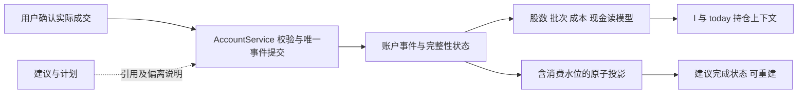

# 第四轮深审：事实资格、账户一致性与研究可达性

2026-09-27｜基线 `def45d1` / v0.8.24｜Codex 架构审查，实施待 Claude Code 承接。本文是 [R10](R10_INDEPENDENT_REVIEW.md) 的增量；涉及同一结论时以本文为新裁决。所有 D 类问题仍 **OPEN**，未修产品代码。

## 结论

**当前最需要的是收紧已有链路的语义与状态归属。** 已有模块能生成数据、评估、计划、观察，但跨模块交接仍把不同概念当成相同概念：找到数字当作核实主张、因子能算当作投资命题成立、成交股数当作建议全部完成、日志追加成功当作事实可重放。这会使更多数据和更频繁的 `l` 调用放大错误。

新增 **10 个独立反例，归为 D1–D7 七类**；原 A1–A4 仍未修。既有目标测试 **180 passed in 6.90s**，与反例同时成立。J0/J2/J3/J4 的场景资格均为 PARTIAL；第三轮实现交付历史保留，不能据此宣称语义门全面关闭。第四轮先 K0a 账户、K0b 事实/命题、K0c 计划/观察，再做 K2a 最小研究闭环；K1 协议设计可同步，正式冻结需纵向走通。`l` 归并随后。

## 证据与复现

```powershell
.\.venv\Scripts\python.exe -B plan/fusion/iteration4/deep_review_probes.py
.\.venv\Scripts\python.exe -B plan/fusion/iteration4/review_test_runner.py
```

- [独立探针](deep_review_probes.py) → [原始结果](DEEP_PROBE_RESULTS.json)：`observed_defect=true` 表示当前缺陷被复现，**不是修复通过**。结果附受检源码 SHA256；只读生产文件，网络/子进程禁止，写操作限制在临时根。输入全部为合成资料。
- [目标测试运行器](review_test_runner.py) → [测试结果](TARGETED_TEST_RESULTS.txt)：10 个既有测试文件，180 绿；网络、真实 `~/.muyun` 访问、临时根外写入被阻断。冻结语料测试的输出路径在运行时重定向至临时目录，测试逻辑未改。真实 `portfolio.yaml` 及 `.bak` 前后哈希一致。
- 早期运行器发生 Windows 编码/当前目录清理、标准库平台探测及测试产物路径冲突，修正隔离运行器后重跑；这些是审查工具错误，不计为产品失败，已记 `.learnings/ERRORS.md`。
- 未独立重跑全量 1297 口径、真实金融外源、付费模型或真实账户回放；没有验证收益。目标测试不是整库认证。

## 七类实证缺陷

### D1｜词元与关键词不能核定同一个事实（P1，K0b）

位置：`src/core/claim_extraction.py:439`、`:669`、`:678`。

| 原文 | 待核主张 | 当前结果 |
|---|---|---|
| 营收100万元，净利润10万元 | 净利润100万元 | FACT_CHECKED |
| 净利润-100万元 | 净利润100万元 | FACT_CHECKED |
| 签订0.900万元订单 | 签订900万元订单 | FACT_CHECKED |
| 本期无新订单 | 公司不存在偿债风险 | FACT_CHECKED |

四例均引用真实存在的合成原文，来源主体和公开时点齐备，无核验失败原因。原因分别是数字与谓词没有局部绑定、数值前只排除数字而未排除符号/小数点、否定只检查两边有否定词。N1 原测试仍绿，**N1 所代表的“摘录不支持结论不得 FACT_CHECKED”性质重新打开**。

修复需要核验同一结构化元组：主体、谓词、带符号数值、单位、报告期/发生期、阶段、否定作用对象。无法确定对应关系时最高 EXCERPT_GROUNDED。首批只支持可确定解析的句式；不通过继续加宽关键词或要求 AI 自报确信来提升级别。规则版本必须更新，旧结论不自动沿用。

### D2｜损坏尾行吞掉新成交，却回报 ACCEPTED（P1，K0a）

位置：`src/data/account_snapshot.py:132`、`:147`；`src/data/account_service.py:156` 的追加/回执路径。

期初现金 10000 → 写入无换行的截断 JSON 尾部 → 确认 BUY 100 股×10 元。当前回执 ACCEPTED；新 JSON 被接在损坏尾部，重放整行丢失，现金仍 10000、持仓空、`isolated_events=[]`、`data_completeness=QUANTITY_LEVEL`。

读侧 logger 告警不等于快照隔离。解析失败没有进入隔离列表，新增风险冻结也看不见。现有测试只验证“坏尾行不影响前面的好事件”，没有验证坏尾后的下一次合法写入。

修复：写锁内先验证日志完整性；损坏时停止新写并给可操作回执，保存损坏原件、行号/偏移/hash供人工恢复。不能只补换行然后宣布账户完整。完整 JSON 但缺最终换行与截断 JSON 分开处理。成功必须能以同 event_id 和内容重放出来；fsync 失败不得假报确定持久化成功，重试先解析已写事件，防重复。

### D3｜投影内部的第二个崩溃窗口仍会重复成交（P1，K0a）

位置：`src/data/portfolio.py:773`、`:902`、`:911`。

原比例 10%，同 fill_id 买入 10%；注入“portfolio 已保存、proposals 尚未 record_fill”中断。重启比例已是 20%，重试同 fill_id 后变 30%，`duplicate=False`。修复过的 J2 窗口是“数量事件已写、比例投影尚未开始”；没有涵盖投影自身分两文件写的窗口。

投影幂等标记必须与投影值同一次原子保存，或从权威事件完整重建后覆盖派生值。不能从第三份文件中的 has_fill 判断第二份文件是否已经消费。断点覆盖每个持久化边界；不要尝试对已经记录的真实成交做静默反向回滚。

### D4｜部分数量成交被投影成完整建议（P1，K0a）

位置：`src/cli/main.py:2303`、`:2334`、`:2365`；真实 `manage_positions` 入口隔离调用。

1000 股、比例 10%、建议 CLOSE_ALL；确认实际卖出 100 股。数量账本正确保留 900 股，但 `change` 缺省取整条建议的 10%，比例路径删掉持仓，建议 CONFIRMED，CLI 显示“比例投影已同步 / 清仓完成”。后续 legacy 持仓分析可能把有仓当无仓。

**数量事实不能由建议目标反推。** 数量账户的 has_position、份额、批次成本来自事件快照；NAV/同窗价格不齐则权重 UNKNOWN，不能拿建议比例补事实。没有可核定目标股数时只能显示已记录本笔成交，不得虚判建议全部完成。比例模式独立标 RATIO_ONLY，不覆盖数量事实。补录日期应贯穿两边，当前 CLI 投影未传 `trade_date`；加仓成本也须派生自批次而非用最新买价覆盖历史成本（后两项为静态同类审查，未单独执行新探针）。

### D5｜可计算能力被误判为投资命题成立（P1，K0b）

位置：`src/core/research.py:239`、`:274`；`src/core/research_service.py:81`；`src/core/factor_compute.py:61`、`:89`。

真实因子函数输入单期 CFO/净利润=-2、ROE=-0.1、净利润500000，两个因子均 status=OK；命题“盈利和现金持续性已建立”求值 TRUE。OK 只代表算出了观察值，求值器没有查看方向、序列长度、口径或命题阈值。

这不证明整条 LONG 已 VALID：moat、估值和长期失效等门仍缺。已证明的是其中必需命题被错误置 TRUE；未来补齐其他门就会放大问题。`PROPOSITION_RULE_VERSION` 只是结构位的披露不能覆盖这项语义错误。

因子继续保留原值；独立的命题规则决定 SUPPORTED/REFUTED/UNKNOWN，再映射现有求值枚举。规则没有实现、所需期间不齐或行业不适用，一律 UNKNOWN 并解释缺口。不得把单期正值直接等价为多期持续性，也不能在本轮凭空冻结投资有效阈值。另需让派生因子保留输入 evidence_ids/报告期/修订/口径；当前 `_get` 独立按发布时间选值，有跨期拼接的静态风险，实施需补反例验证。

### D6｜快照没有证券主体边界（P2，K0b）

位置：`src/data/research_snapshot.py:266`，特别是 records 循环。

`EvidenceSnapshot.build('600519', ..., [000002 的财务记录], strict=False)` 保留记录，顶层证券仍为600519。已证明公共构建边界未拒绝错主体；**未证明现有正常财务抓取会自动错配**，生产触发概率需追踪上游。这是共享快照即将扩大消费前需要封闭的合同缺口。

证券财务记录要求精确匹配；行业/宏观公共记录用显式 scope/关联规则表示，不把所有空主体记录混同财务。因子绑定应核对成员资格，而不只核对快照外壳 security_id。

### D7｜可用现金定义与扣减公式互相矛盾（P2，K0a）

位置：`src/data/account_snapshot.py:68`、`:89`，离散预算消费 `cash_deployable`。

模型说明称 cash_available 已扣冻结、reserved 另记不重复减；输入可用1000、冻结200，属性却再减得800。当前常见 replay 的 reserved 为0，差异隐藏；没有证明真实用户当前多扣了200。

按已写明合同统一成“可用=扣冻结后”的净额，保留冻结额仅做解释。若改变字段口径必须版本化迁移，不能仅改注释让旧记录换意义；补含冻结的分配测试。

## 框架审查：三个需要作出的设计裁决

### 1. 写入权威事实与读取派生视图必须分开



保留现有 AccountService / PortfolioManager，不新增一套并行账户框架。数量账户由事件拥有事实，PortfolioManager 承载元数据/派生兼容视图；纯比例旧账户仍可读，明确未迁移。按证券/账户显式标识迁移状态，禁止用建议量构造缺失的历史股数和现金。读模型落后时显示“成交已记录、视图待恢复”，一致性恢复前不以旧投影产生新风险建议。两份派生文件可以暂时不同步，但不能各自声称是成交真值。

### 2. 研究需要一条用户可走通的正向路径

静态链路：`ResearchApplicationService.run`（82–156）只读季度财务并传 factor_capabilities，**没有传 documents/claims/checkpoints，也没有对应入参**。MID 三个必需命题需要已核事实/风险确认，财务补得再多也不能建立这条公开入口的合法 MID 正例。`source_uris` 来自未传入的文档集合，因此真实来源跳转也缺接线。这属于输入通道缺失，不能统称“等待更多数据”。

K2a 先完成：归档原文 → 可核定 claim → 逐命题证据 → 明示风险条件并由用户确认 → 持久化 assessment → 候选草稿 → 接受精确版本 → 一次影子诊断。使用本地 fixture 验证完整通路；真实观察必须另从用户实际资料积累。LONG 规则不齐就显示具体缺口，不追求本轮把两个周期都刷成 VALID。

### 3. 计划生命周期与观察必须消费同一份已接受版本

保留 A1–A4 的原裁决：候选与接受版本分离；评估 snapshot 非空且精确匹配；真实变更不被去重。实际持仓的主意图使用 account×security 的单一 active_ref；MID/LONG 可并存研究，不按“先找到 MID 就用 MID”决定成交引用。当前数量确认 CLI 未注入计划库也未传主计划引用，底层相应测试不等于生产支持（静态接线发现）。该接线纳入 K0c/K2a，不另外扩展策略评分。

## 为什么现有测试没发现

- 数值边界只覆盖1900含900，没覆盖负号、小数点、同句多个指标和不同否定对象。
- 崩溃只打断在两个服务之间，没打断到第二个服务内部的两个文件之间。
- 截断尾行只读旧账本，没继续追加一笔有效事件并核对回执。
- 确认路径服务层传固定 fill_id；本轮 D4 从 CLI 将 qty 转换为 ratio 时才暴露。
- 多数断言证明“存在字段/引用/OK”，没有独立验证“这条材料能否支持命题”。

验收以不变量为单位：不丢成交、不重复消费、同一事实跨视图一致、不能把不相干证据升格、用户接受态不被重放改变。实施方把反例写进正式测试并先红后绿，架构师探针保留独立期望，不按新实现重写预期。

## 发布与实施边界

K0 前数量确认/自动投影不予完整验收，不沿用 R10 初稿“账户确认可继续正常使用”的笼统许可；部署中的用户需核对部分成交后持仓和异常回执。历史真实账本如需对账，只在明确范围内只读比较，修复方案另行确认，不从本次合成反例推断真实账户已损坏。普通 legacy 研究主线仍保持原决策，融合执行 `capture_only`。

本审查交付是任务依据，**不是修复完成**。具体责任边界与验收见 [DELIVERY_PLAN](DELIVERY_PLAN.md)，恢复指纹见 [REVIEW_INDEX](REVIEW_INDEX.json)。
